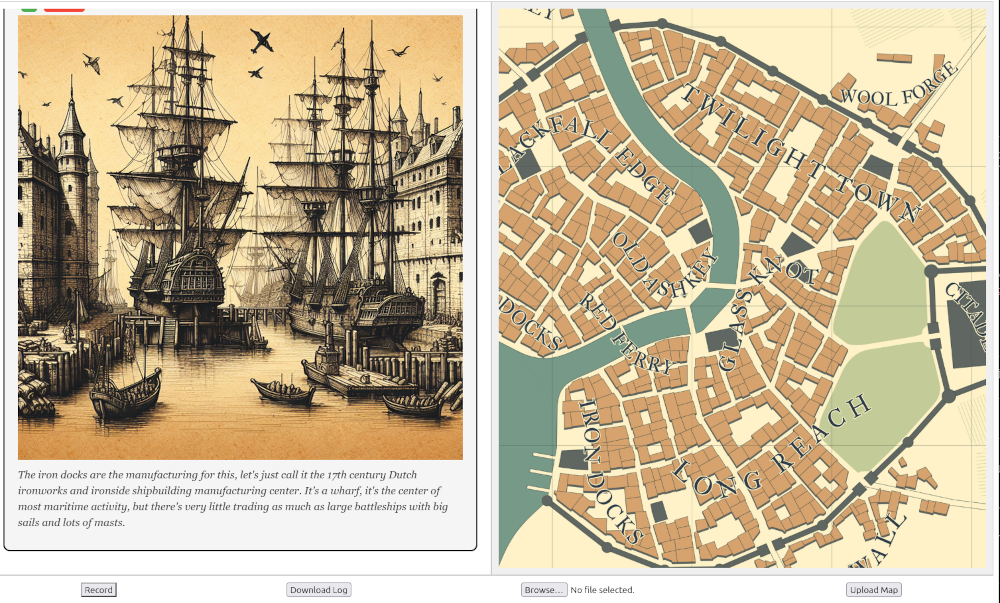

# AI Adventure Assistant

This is a simple Flask learning project. It leverages OpenAI's API services to enhance user interaction with voice and text commands.

## Features

- **Create Notes**: Using voice or text input.
- **Convert Notes to Images**: Using OpenAI's DALL-E.
- **Display Content**: Show maps or image files.
- **Log Management**: Save and manage your log files.
- **Sample Image**: An example image can be found in `static/images/sample_image.png`.

## Prerequisites

- A valid OpenAI API Key.

## Installation and Running

1. Clone the repository:
    ```bash
    git clone <repository_url>
    ```
2. Navigate to the project directory:
    ```bash
    cd <project_directory>
    ```
3. Install the required packages:
    ```bash
    pip install -r requirements.txt
    ```
4. Run the project:
    ```bash
    python serve.py
    ```

## Creating a Docker Container

1. Clone the repository:
    ```bash
    git clone <repository_url>
    ```
2. Navigate to the project directory:
    ```bash
    cd <project_directory>
    ```
3. Build the Docker image:
    ```bash
    docker build -t <your_tag_here> .
    ```
4. Run the Docker container:
    ```bash
    docker run -e OPENAI_API_KEY=<your_key> -p 5000:5000 <your_tag_here>
    ```

## Sample Image

Below is a sample image used in this project:



---

Feel free to explore and contribute to the project! If you encounter any issues, please open an issue on GitHub.
